# PRAXIS_ — Real-Time Voice Integrity for Live Calls

Public website for Praxis. Built with TanStack Start, React 19, TypeScript, Vite 7 and Tailwind CSS v4.

## Requirements
- Node.js 20+ (or Bun 1.1+)

## Setup
```sh
npm install        # or: bun install
npm run dev        # open http://localhost:8080
```

## Production build
```sh
npm run build
npm run preview
```

## Project structure
- `src/routes/` — pages (/, /try, /how-it-works, /docs, /validation, /security, /faq, /use-praxis)
- `src/components/praxis/` — site sections (Hero, TryPraxis, AttackLab, ArchitectureCanvas, ...)
- `src/styles.css` — design tokens and utilities

## Editing content
- Validation status: `src/components/praxis/ValidationMatrix.tsx` (COMPONENTS array)
- Team: `src/components/praxis/TeamSection.tsx`
- APK/QR placeholders: `src/components/praxis/FullPraxisCTA.tsx`

## Sharing
- **Live link:** publish from Lovable (Publish button) for a permanent public URL.
- **Temporary preview:** Lovable → Share → Share preview (7 days, no login).
- **Code:** push this folder to GitHub, or share this ZIP.
- **Self-host:** run `npm run build` and deploy to any Node/edge host (default target: Cloudflare Workers).

Demo and scenario simulations on the site are clearly marked and do not represent real model inference.

# Praxis_ System Architecture

> **Praxis_** analyzes live call audio, combines acoustic, linguistic, identity and trusted contextual evidence, and produces an operational malicious-impersonation risk score with policy-driven actions.

---

## Interactive Architecture Overview

```mermaid
flowchart LR

    %% =========================================================
    %% ENTRY
    %% =========================================================

    CALL["📞 Live SIM Call"]
    SDK["Praxis_ SDK / Host"]

    CALL --> SDK

    %% =========================================================
    %% PREPROCESSING
    %% =========================================================

    subgraph PRE["1 · Audio Preprocessing"]
        direction TB

        DEC["Decode Audio"]
        MONO["Convert to Mono"]
        SR["Resample to 16 kHz"]
        VAD["Silero VAD"]
        WIN["4 s Acoustic Windows"]
        ASRBUF["Rolling ASR Buffer"]

        DEC --> MONO
        MONO --> SR
        SR --> VAD

        VAD --> WIN
        VAD --> ASRBUF
    end

    SDK -->|"Authorized audio"| DEC


    %% =========================================================
    %% ACOUSTIC PATH
    %% =========================================================

    subgraph ACOUSTIC["2 · Acoustic Evidence"]
        direction TB

        W2V2["W2V2 / XLS-R + AASIST<br/>Primary Anti-Spoof Detector"]

        PROS["Prosody Features<br/>openSMILE + Parselmouth"]

        ECAPA["ECAPA-TDNN<br/>Optional Speaker Verification"]
    end

    WIN --> W2V2
    WIN --> PROS
    WIN --> ECAPA


    %% =========================================================
    %% LANGUAGE PATH
    %% =========================================================

    subgraph LANGUAGE["3 · Language Understanding"]
        direction TB

        WHISPER["Whisper Small Multilingual"]

        MINILM["MiniLM<br/>Social Engineering"]

        RULES["Rules Engine<br/>Deterministic Evidence"]

        QWEN["Qwen<br/>Scripted Language Evidence"]

        WHISPER --> MINILM
        WHISPER --> RULES
        WHISPER --> QWEN
    end

    ASRBUF --> WHISPER


    %% =========================================================
    %% CONTEXT
    %% =========================================================

    subgraph CTX["4 · Context Engine V2"]
        direction TB

        CONTEXT["Context Engine"]

        AUTH["Authorized Synthetic Context"]

        IDENT["Identity Risk"]

        SENS["Sensitive Action Context"]

        CONTEXT --> AUTH
        CONTEXT --> IDENT
        CONTEXT --> SENS
    end

    SDK -->|"Trusted host metadata"| CONTEXT
    W2V2 -->|"Synthetic evidence"| CONTEXT
    ECAPA -->|"Speaker evidence"| IDENT

    MINILM --> SENS
    RULES --> SENS


    %% =========================================================
    %% FUSION
    %% =========================================================

    subgraph FUSION_BLOCK["5 · Evidence Fusion"]
        direction TB

        AVAIL["Evidence Availability<br/>Available / Low Quality / Unavailable / Error"]

        FUSION["Deterministic Hierarchical<br/>Evidence Fusion"]

        AVAIL --> FUSION
    end

    W2V2 -->|"Acoustic"| FUSION
    PROS -->|"Supporting"| FUSION

    MINILM -->|"Semantic"| FUSION
    RULES -->|"Rules"| FUSION
    QWEN -->|"Supporting"| FUSION

    AUTH -->|"Authorization"| FUSION
    IDENT -->|"Identity"| FUSION
    SENS -->|"Sensitive action"| FUSION


    %% =========================================================
    %% RISK
    %% =========================================================

    RISK["6 · Praxis_ Risk Engine<br/>Malicious Impersonation Risk<br/>0–100"]

    FUSION --> RISK


    %% =========================================================
    %% POLICY
    %% =========================================================

    subgraph POLICY_BLOCK["7 · Policy Engine"]
        direction TB

        POLICY["Policy Evaluation"]

        ALLOW["0–39<br/>ALLOW"]
        WARN["40–59<br/>WARN"]
        VERIFY["60–79<br/>SECONDARY VERIFICATION"]
        ESC["80–89<br/>ESCALATE"]
        HOLD["90–100<br/>HOLD*"]

        POLICY --> ALLOW
        POLICY --> WARN
        POLICY --> VERIFY
        POLICY --> ESC
        POLICY --> HOLD
    end

    RISK --> POLICY


    %% =========================================================
    %% HOLD SAFETY
    %% =========================================================

    GATES["HOLD Safety Gates<br/>Independent Evidence Required"]

    W2V2 --> GATES
    AUTH --> GATES
    IDENT --> GATES
    SENS --> GATES
    MINILM --> GATES
    RULES --> GATES

    GATES --> HOLD


    %% =========================================================
    %% PRODUCT
    %% =========================================================

    subgraph PRODUCT["8 · Product Outputs"]
        direction TB

        MOBILE["Android / Call-Side Protection"]

        DASH["React Dashboard"]

        AUDIT["Evidence + Audit Record"]
    end

    POLICY --> MOBILE
    POLICY --> DASH

    FUSION --> AUDIT
    POLICY --> AUDIT


    %% =========================================================
    %% INFRA
    %% =========================================================

    subgraph INFRA["9 · Infrastructure"]
        direction TB

        API["FastAPI Backend"]
        DB["PostgreSQL"]
        SEC["JWT + RBAC<br/>AES-256-GCM<br/>TLS / WSS"]
        DEPLOY["Docker + Caddy"]

        API --> DB
        API --> SEC
        API --> DEPLOY
    end

    SDK --> API
    API --> FUSION
    POLICY --> API
    AUDIT --> DB


    %% =========================================================
    %% STYLING
    %% =========================================================

    classDef entry fill:#eaf2ff,stroke:#4285f4,color:#111827,stroke-width:2px;
    classDef audio fill:#eef5ff,stroke:#4285f4,color:#111827;
    classDef acoustic fill:#fff1e8,stroke:#ff7a21,color:#111827;
    classDef support fill:#eaf8ef,stroke:#34a853,color:#111827;
    classDef language fill:#f4efff,stroke:#8b5cf6,color:#111827;
    classDef context fill:#eaf8ef,stroke:#34a853,color:#111827;
    classDef fusion fill:#fff1e8,stroke:#ff7a21,color:#111827,stroke-width:2px;
    classDef risk fill:#fff0f0,stroke:#e5484d,color:#111827,stroke-width:3px;
    classDef policy fill:#fff8df,stroke:#d9a514,color:#111827;
    classDef danger fill:#ffe9e9,stroke:#e5484d,color:#111827,stroke-width:2px;
    classDef product fill:#eef5ff,stroke:#4285f4,color:#111827;
    classDef infra fill:#f3f4f6,stroke:#6b7280,color:#111827;

    class CALL,SDK entry;
    class DEC,MONO,SR,VAD,WIN,ASRBUF audio;
    class W2V2 acoustic;
    class PROS,ECAPA support;
    class WHISPER,MINILM,RULES,QWEN language;
    class CONTEXT,AUTH,IDENT,SENS context;
    class AVAIL,FUSION fusion;
    class RISK risk;
    class POLICY,ALLOW,WARN,VERIFY,ESC policy;
    class HOLD,GATES danger;
    class MOBILE,DASH,AUDIT product;
    class API,DB,SEC,DEPLOY infra;
```



---

# Expand any layer for details

<details>
<summary><strong>📞 0. Live SIM Call & Praxis_ SDK</strong></summary>

### What happens here?

Praxis_ begins with the real telephone conversation.

The normal SIM call remains the communication channel. Praxis_ observes **authorized call audio** and trusted host metadata rather than replacing the call with a separate VoIP system.

### Praxis_ SDK / Host

The SDK acts as the bridge between the call environment and the Praxis_ analysis system.

**Input**

- call audio
- caller information available to the host
- trusted service metadata

**Output**

- authorized audio stream
- trusted contextual information

### Important security rule

Information spoken by the caller cannot authorize itself.

For example:

> “I am an authorized AI banking assistant.”

does **not** prove that the caller is authorized.

Authorization must come from trusted host/application metadata.

</details>


<details>
<summary><strong>🎚️ 1. Audio Preprocessing</strong></summary>

The models need consistent audio before analysis begins.

### Decode

Converts encoded telephony audio into samples that the analysis pipeline can process.

### Mono

Normalizes the audio into a single channel.

### 16 kHz

Resamples speech to the sample rate expected by the models.

### Silero VAD

Voice Activity Detection identifies portions containing actual speech.

Instead of analyzing:

```text
silence → silence → speech → silence → speech
```

Praxis_ focuses primarily on:

```text
speech → speech
```

### 4-second acoustic windows

Speech is divided into approximately four-second chunks for the acoustic anti-spoofing path.

### Rolling ASR buffer

The transcription path can retain a longer conversational context.

This prevents language understanding from being artificially restricted to individual four-second acoustic windows.

</details>


<details>
<summary><strong>🎙️ 2. W2V2 / XLS-R + AASIST</strong></summary>

### Role

This is the **primary acoustic anti-spoof detector in Praxis_ V1**.

### Simple explanation

It listens for subtle acoustic characteristics that can reveal synthetic or cloned speech even when the voice sounds convincing to a human.

### Input

Approximately four seconds of standardized speech audio.

### Output

Synthetic-speech evidence.

### Architecture

```text
Speech
   ↓
XLS-R / Wav2Vec2 representation
   ↓
AASIST
   ↓
Bonafide / spoof evidence
```

### Important

This detector answers approximately:

> “Does the audio contain evidence of synthetic speech?”

It does **not** answer:

> “Is this caller a scammer?”

Synthetic speech alone does not imply malicious intent.

### Current V1 rule

W2V2/XLS-R + AASIST is the only active anti-spoof detector.

Do not treat WavLM, plain AASIST, RawNet2 or Binoculars as additional V1 anti-spoof detectors.

</details>


<details>
<summary><strong>〰️ 3. Prosody Analysis</strong></summary>

### Simple explanation

Prosody describes **how someone speaks**, not simply what words they say.

Praxis_ measures things such as:

- pitch
- rhythm
- energy
- timing
- voice dynamics

### Tools

- openSMILE eGeMAPSv02
- Praat / Parselmouth

### Output

**98 explicit prosodic features.**

### Role in Praxis_

Prosody currently provides supporting evidence.

It does **not** independently output an AI-voice probability.

The previously tested prosody XGBoost classifier is not used as an active score-bearing V1 detector.

</details>


<details>
<summary><strong>👤 4. ECAPA-TDNN Speaker Identity</strong></summary>

### Question

> “Does this voice resemble the person we expected to hear?”

### Input

- current caller voice
- previously enrolled reference voice

### Output

Speaker-consistency evidence.

### Why this matters

A cloned voice might acoustically imitate someone known to the victim.

Speaker verification gives Praxis_ an evidence source that is different from synthetic-speech detection.

### Missing enrollment

If no reference speaker exists:

```text
ECAPA = UNAVAILABLE
```

Not:

```text
ECAPA = suspicious
```

Missing evidence must never automatically increase risk.

</details>


<details>
<summary><strong>📝 5. Whisper Small Multilingual</strong></summary>

Whisper converts speech into text.

### Example

```text
AUDIO
"Do not tell anyone. Send the money now."

        ↓ Whisper

TRANSCRIPT
"Do not tell anyone. Send the money now."
```

The transcript feeds the linguistic-analysis systems.

This gives Praxis_ information about **what the caller wants the victim to do**.

</details>


<details>
<summary><strong>🧠 6. MiniLM Social-Engineering Detection</strong></summary>

MiniLM analyzes the meaning of the conversation.

It can identify categories such as:

- urgency
- secrecy
- authority pressure
- financial request
- credential request
- verification bypass
- coercion
- emotional pressure

### Example

```text
"Do it immediately."

→ URGENCY
```

```text
"Tell me your OTP."

→ CREDENTIAL REQUEST
```

```text
"Transfer the money now."

→ FINANCIAL REQUEST
```

MiniLM provides semantic evidence.

It does not independently declare that the caller is fraudulent.

</details>


<details>
<summary><strong>📏 7. Deterministic Rules Engine</strong></summary>

The rules engine detects high-precision, explainable suspicious-language patterns.

Examples include:

- secrecy requests
- urgent financial instructions
- requests for passwords or OTPs
- threats
- authority pressure
- verification bypass
- suspicious links
- remote-access requests

### Why use rules when MiniLM already exists?

Because deterministic rules are easy to explain.

For example:

```text
"Do not tell anybody about this call."

→ secrecy rule
```

The system can explicitly show why that evidence appeared.

</details>


<details>
<summary><strong>🤖 8. Qwen Script Detector</strong></summary>

Qwen provides supporting evidence about whether language appears highly scripted or machine-generated.

### Important distinction

Qwen analyzes **text**.

It does not prove the **audio** is synthetic.

Therefore:

```text
High Qwen evidence
≠
AI voice detected
```

and:

```text
High Qwen evidence alone
≠
HOLD
```

Qwen remains a supporting evidence source.

</details>


<details>
<summary><strong>🧭 9. Context Engine V2 — Core Praxis_ Differentiator</strong></summary>

This is one of the most important layers in Praxis_.

### The problem

A simplistic system might assume:

```text
Synthetic voice
      ↓
SCAM
```

Praxis_ does **not** make that assumption.

Instead:

```text
Synthetic evidence
        +
Identity context
        +
Service authorization
        +
Sensitive actions
        +
Language evidence
        ↓
Actual malicious impersonation risk
```

### Example A — legitimate synthetic speech

```text
Strong synthetic evidence
+
Verified AI service
+
Synthetic speech authorized
+
No suspicious sensitive action

        ↓

LOW malicious risk
```

Example: an authorized AI/TTS banking assistant.

### Example B — suspicious impersonation

```text
Strong synthetic evidence
+
Unverified caller
+
Unexpected synthetic voice
+
Identity inconsistency
+
Money / OTP request

        ↓

HIGH malicious impersonation risk
```

### Trusted fields can include

- `ai_voice_expected`
- `synthetic_voice_authorized`
- `trusted_service`
- `service_identity_verified`
- `caller_verified`
- `number_spoof_suspected`
- `first_time_caller`
- `caller_in_contacts`
- `sensitive_action_requested`
- `transaction_requested`
- `credential_requested`

### Critical rule

Transcript content cannot authorize synthetic speech.

Authorization comes from trusted host/application context.

</details>


<details>
<summary><strong>🔗 10. Hierarchical Evidence Fusion</strong></summary>

Praxis_ V1 currently uses:

```text
DETERMINISTIC_HIERARCHICAL_V1
```

The fusion layer combines independent evidence.

### Acoustic

- W2V2/XLS-R + AASIST
- prosody support
- optional ECAPA identity evidence

### Linguistic

- MiniLM
- Rules
- Qwen support

### Context

- authorization
- identity
- sensitive action
- trusted service information

### Why hierarchical?

A single model should not control the final decision.

For example:

```text
Synthetic voice only
```

is weaker evidence than:

```text
Synthetic voice
+
unverified identity
+
money request
+
credential request
+
social-engineering language
```

### Important

Praxis_ V1 does not invent arbitrary model weights such as:

```text
W2V2 60%
MiniLM 20%
Context 20%
```

The current V1 fusion is deterministic and evidence-driven.

</details>


<details>
<summary><strong>⚠️ 11. Evidence Availability</strong></summary>

Praxis_ explicitly tracks whether evidence exists.

Possible states include:

```text
AVAILABLE
LOW_QUALITY
UNAVAILABLE
ERROR
```

### Why?

Imagine ECAPA cannot run because no speaker has been enrolled.

Bad implementation:

```text
speaker_match = 0.5
```

That invents evidence.

Praxis_ instead records:

```text
speaker evidence = UNAVAILABLE
```

This prevents missing data from silently changing risk.

</details>


<details>
<summary><strong>🎯 12. Praxis_ Risk Engine</strong></summary>

The fusion result is converted into one operational score:

# 0–100

This represents:

**malicious impersonation risk**

It does NOT mean:

```text
93 = 93% probability of fraud
```

and does NOT mean:

```text
93 = 93% AI voice
```

It is an operational score designed for policy decisions.

Example:

```text
18
LOW RISK

42
ELEVATED

67
STRONG CONCERN

93
HIGH MALICIOUS IMPERSONATION RISK
```

</details>


<details>
<summary><strong>🛡️ 13. Policy Engine</strong></summary>

The policy engine translates evidence and risk into an action.

| Risk | Action |
|---:|---|
| 0–39 | ALLOW |
| 40–59 | WARN |
| 60–79 | SECONDARY VERIFICATION |
| 80–89 | ESCALATE |
| 90–100 | HOLD* |

### Important

`90+` does **not automatically mean HOLD**.

HOLD requires additional safety gates.

</details>


<details>
<summary><strong>⛔ 14. HOLD Safety Gates</strong></summary>

HOLD is intentionally difficult to trigger.

The system requires independent evidence such as:

```text
Synthetic voice detected
        +
Synthetic voice NOT authorized
        +
Identity risk
        +
Sensitive action
        +
Primary social-engineering evidence
```

Only then can HOLD become eligible.

### Therefore

```text
Qwen high
→ NOT enough
```

```text
Synthetic voice high
→ NOT enough
```

```text
Prosody unusual
→ NOT enough
```

This protects the system from one weak or incorrect detector causing an aggressive intervention.

If the host environment cannot actually hold a call, Praxis_ can escalate instead.

</details>


<details>
<summary><strong>📱 15. Product Outputs</strong></summary>

The final policy result can feed the call-side experience.

Possible actions:

- **ALLOW**
- **WARN**
- **VERIFY**
- **ESCALATE**
- **HOLD**

The caller-facing/mobile experience should remain simple.

Detailed technical evidence belongs primarily in the operator/audit interface.

</details>


<details>
<summary><strong>📊 16. Evidence & Audit Layer</strong></summary>

Praxis_ can preserve:

- acoustic evidence
- transcript evidence
- semantic labels
- rule matches
- context
- model availability
- risk score
- policy decision

This allows operators and developers to understand:

> Why did Praxis_ reach this decision?

rather than exposing only a mysterious number.

</details>


<details>
<summary><strong>⚙️ 17. Backend & Infrastructure</strong></summary>

### Backend

- Python
- FastAPI
- REST
- WebSocket / WSS

The backend orchestrates the analysis engines.

### Database

- PostgreSQL
- SQLite may be used during lightweight prototype development

### Security

- JWT
- RBAC
- TLS / WSS
- AES-256-GCM where applicable

### Deployment

- Docker
- Caddy

### Frontend

- React
- TypeScript
- Vite

### Mobile

- Android / Kotlin

</details>

---

## Core Praxis_ Principle

> **Synthetic speech is evidence — not guilt.**

Praxis_ combines voice authenticity, language, identity and trusted context before deciding whether a call represents malicious impersonation.

© 2026 Praxis_


