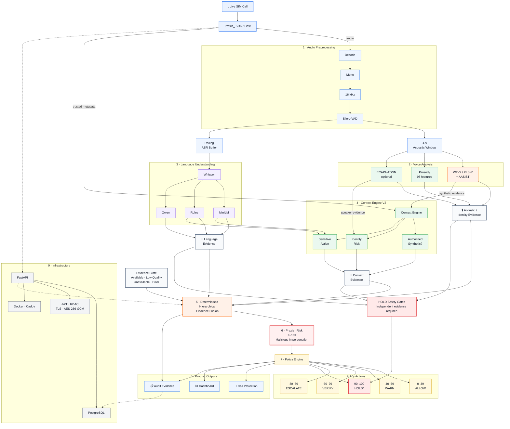

# Praxis

# Praxis_ System Architecture

> **Praxis_** analyzes live call audio, combines acoustic, linguistic, identity and trusted contextual evidence, and produces an operational malicious-impersonation risk score with policy-driven actions.

---


Praxis_ combines voice authenticity, language, identity and trusted context before deciding whether a call represents malicious impersonation.

© 2026 Praxis_

Praxis is a voice-analysis prototype with a FastAPI/PostgreSQL backend, an authenticated live dashboard, an Android caller, and a separate public website. The Android **Internet** calling demo relays audio between two signed-in Praxis users and analyzes the incoming voice on each phone. The repository also contains the SDK, tests, and deployment scripts.

**Status:** A two-phone demo has delivered analysis to both phones, but a later call connected without delivering detailed analysis. The current V2 score uses a `BOOTSTRAP_UNTRAINED` risk regressor: it is experimental, not a calibrated probability of a scam. CPU inference can lag behind live speech. This is not a production-ready, always-on calling service.

## Find your way around

| Path | Purpose |
| --- | --- |
| [`backend/`](backend/) | FastAPI, authentication, session and analysis APIs, PostgreSQL persistence, and VoIP relay |
| [`praxis-dashboard/`](praxis-dashboard/) | Authenticated React/Vite dashboard for live sessions and analysis history |
| [`integrations/android/Praxis_Caller/`](integrations/android/Praxis_Caller/) | Android caller source; Internet calls and cellular dialer are separate modes |
| [`android-sdk/`](android-sdk/) | Praxis Android SDK source |
| [`deployment/`](deployment/) | Docker Compose, PostgreSQL, backend, and Caddy configuration |
| [`scripts/`](scripts/) | Startup, account creation, verification, and maintenance commands |
| [`src/`](src/) | Separate public website; its demonstrations are not live model inference |
| [`docs/`](docs/) | Architecture, traceability, deployment, and verification records |

Model weights, the local `model_paths.json`, environment secrets, database volumes, raw audio, and generated APKs are intentionally absent from Git. A source checkout alone cannot run the full model pipeline. Use the pinned asset information and deployment instructions in [`docs/`](docs/) and keep existing verified artifacts unchanged.

## Run the local backend and dashboard

On Windows, install/start Docker Desktop with Linux containers. From the repository root in PowerShell:

```powershell
.\scripts\start.ps1
```

The script starts the persistent local model worker when configured, then PostgreSQL, backend, and HTTPS dashboard. First model load can take several minutes. It prints the current LAN address for phones; the address can change when your network changes. The script creates `.env` only when missing and does not overwrite existing keys. Never commit `.env`.

Open `https://localhost/` after startup. A browser or phone must trust the Praxis local CA for local HTTPS; do not bypass certificate validation. The backend health endpoint is `/api/v1/health`. No default administrator credentials exist. To create an organization administrator interactively:

```powershell
docker compose --env-file .env -f deployment/compose.yaml exec backend python /app/scripts/create_admin.py
```

See [`docs/DEPLOYMENT.md`](docs/DEPLOYMENT.md) for model assets, TLS, PostgreSQL, security, and verification details. To rebuild the dashboard served by local Caddy, run `.\scripts\deploy-dashboard.ps1` and restart Praxis, or use [`praxis-dashboard/start.cmd`](praxis-dashboard/start.cmd).

## Android Internet-call demo

Download the [current demo APK from GitHub Releases](https://github.com/Debopom26/Praxis_/releases/tag/v0.1.0-voip-demo). It is **debug-signed**, includes the local development CA for test connections, and is not a Play Store or production build. Its SHA-256 is `5A8E543DA0F8CBF3117DABBFE3FDFCFC8E387210E489B15D44559CD4CDE1FCBD`.

Both participants need the app, different active Praxis accounts in the same organization, and a connection to the same reachable backend. Enter the current HTTPS server address shown by `start.ps1` when testing on one LAN. A signed-in user places an Internet call to the other user's Praxis username; the recipient accepts in the app. Each phone analyzes the **other** person's voice. The Internet mode does not call ordinary SIM/PSTN numbers or emergency services. Incoming ringing after the app process is stopped requires push delivery, which is not implemented here. Read [`docs/VOIP_DEMO.md`](docs/VOIP_DEMO.md) for setup and limitations.

The cellular dialer can place normal phone calls, but Android may silence third-party microphone capture during a cellular call. It cannot reliably obtain the remote voice for Praxis analysis. This is why the two-party demo uses Internet calling.

## Deploy the dashboard later with Cloudflare Pages

The dashboard is separate from the public website. Connect this GitHub repository to Cloudflare Pages with root directory `praxis-dashboard`, build command `npm run build`, and output directory `dist`. Set the Pages runtime variable `PRAXIS_BACKEND_ORIGIN` to the **public HTTPS origin** of the Praxis backend. The included Pages Function forwards same-origin `/api/*` requests; a private `10.x.x.x` or `192.168.x.x` address cannot serve a cloud-hosted dashboard. The backend and model worker must themselves be hosted and reachable for sign-in and live analysis to work. Cloudflare hosting is not yet configured. See [`praxis-dashboard/README.md`](praxis-dashboard/README.md).

## Development checks

```powershell
.\scripts\test.ps1
cd praxis-dashboard
npm ci
npm run build
```

For the Android app, run `gradlew.bat :app:testDebugUnitTest :app:lintDebug :app:assembleDebug` from `integrations/android/Praxis_Caller/`. These checks validate code and builds; they do not prove phone audio routing, detection accuracy, or cloud availability. See [`docs/TRACEABILITY.md`](docs/TRACEABILITY.md) for the verified scope and remaining gaps.
