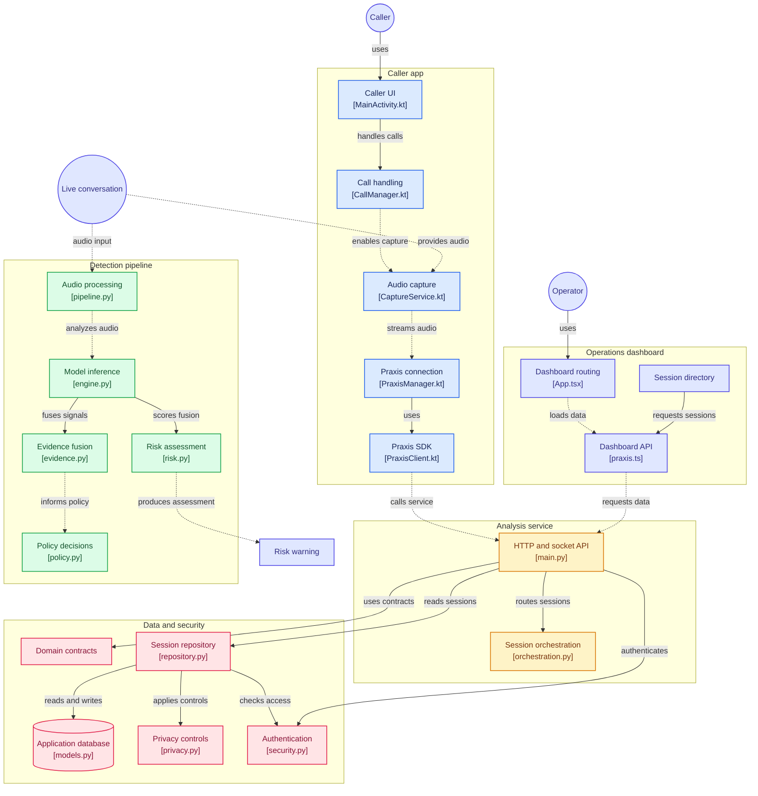

# 🛡️ PRAXIS
### Real-Time AI-Powered Voice Scam Detection & Protection System

<p align="center">

  
  
  
  

</p>

<p align="center">
  <b>PRAXIS detects potential voice scams during live conversations by analysing speech, voice characteristics, conversational context and scam patterns — then converts these signals into an actionable risk assessment.</b>
</p>

---

## 🧠 What is PRAXIS?

**PRAXIS** is an AI-driven voice scam detection and protection platform designed to identify suspicious behaviour during phone conversations.

Traditional fraud detection systems often operate **after** a scam has already occurred.

PRAXIS focuses on the critical moment:

> **While the conversation is happening.**

Instead of depending on a single AI model, PRAXIS combines multiple independent signals:

- 🎙️ Voice characteristics
- 🗣️ Speech content
- 🧠 Conversational context
- 🔊 Audio authenticity / spoof detection
- 🚨 Known scam patterns
- 📊 Behavioural evidence

These signals are passed through an **evidence-fusion and risk-engine layer** to produce a unified risk assessment.

---

# 🚨 The Problem

Voice-based scams are becoming increasingly sophisticated.

Attackers can use:

- Social engineering
- Impersonation
- Urgency and fear
- Fake banking support
- OTP requests
- KYC scams
- Investment scams
- Government impersonation
- AI-generated / synthetic voices
- Manipulated or replayed audio

A simple keyword detector is not enough.

For example:

> "Your bank account has been flagged. Please verify your OTP immediately."

The system needs to understand more than the word `OTP`.

It needs to determine:

**What is being said?**

**Who is speaking?**

**Does the voice appear authentic?**

**Does the conversation resemble a known scam pattern?**

**How dangerous is the overall interaction?**

This is the problem PRAXIS attempts to solve.

---

https://github.com/user-attachments/assets/f0ce1f3b-13a4-4fc9-9f0a-44b1e86ed6d9

[](https://gitdiagram.com/debopom26/praxis_?utm_source=readme&utm_medium=picture)



# 🎯 Core Objective

PRAXIS aims to provide:

```text
LIVE CONVERSATION
       ↓
AUDIO CAPTURE
       ↓
MULTI-SIGNAL AI ANALYSIS
       ↓
EVIDENCE FUSION
       ↓
RISK ENGINE
       ↓
REAL-TIME WARNING
```

---

# 🚀 How to Use PRAXIS

There are four practical ways to work with this repository:

| What you want to do | Start here |
|---|---|
| **Use the deployed Praxis dashboard** | [Open the live dashboard](https://praxisdashboard.debopomrc2602.workers.dev) |
| **Run the full stack locally on Windows** | [`scripts/start.ps1`](scripts/start.ps1) |
| **Use/test the Android caller app** | [`integrations/android/Praxis_Caller`](integrations/android/Praxis_Caller) |
| **Integrate Praxis into another Android app** | [`android-sdk`](android-sdk) |

> [!IMPORTANT]
> End users do **not** need Azure or Microsoft access to use Praxis. Cloud infrastructure is controlled server-side. Users authenticate with Praxis credentials only.

## 🌐 1. Use the Live Dashboard

**Dashboard:** https://praxisdashboard.debopomrc2602.workers.dev

1. Open the dashboard in a modern browser.
2. Sign in using a valid Praxis account.
3. If the analysis server is sleeping, the dashboard is designed to request startup automatically. Keep the page open while it shows **Starting Praxis…**.
4. The client retries while the backend and model services become ready.
5. Once authenticated, use the dashboard to inspect available sessions, analysis results, evidence and risk information exposed to your account.

A normal user should never need to sign in to Azure, Microsoft Entra, Cloudflare, or the VM itself.

### Cold start behaviour

Praxis uses an on-demand backend so compute does not need to remain running continuously.

```text
Open Praxis / attempt login
          ↓
Backend already online? ── Yes ──→ Continue normally
          │
          No
          ↓
Dashboard requests server startup
          ↓
Cloudflare controller starts the backend infrastructure
          ↓
"Starting Praxis…"
          ↓
Client retries until the API is ready
          ↓
Praxis verifies the supplied login credentials
```

The infrastructure controller enforces its own runtime/idle policy. Manual infrastructure controls are separate from ordinary Praxis login.

---

# 💻 Developer Quick Start

## 2. Web Dashboard

The dashboard is React + TypeScript + Vite.

```bash
cd praxis-dashboard
npm install
npm run dev
```

For validation/production builds:

```bash
npm run typecheck
npm run build
```

The generated dashboard is only the client. API requests still require a reachable Praxis backend.

---

## 3. Run the Full Stack Locally on Windows

The verified local deployment uses **Docker Desktop with Linux containers** and a **Python 3.11 virtual environment**. Detailed deployment and security notes are in [`docs/DEPLOYMENT.md`](docs/DEPLOYMENT.md).

From a prepared developer checkout, start PostgreSQL, migrations, the backend, the local model worker and HTTPS edge with:

```powershell
.\scripts\start.ps1
```

The startup script:

- checks Docker availability,
- creates `.env` through `scripts/init-env.ps1` if it does not already exist,
- starts/reuses the local model worker when enabled,
- starts the Docker Compose services,
- exposes the local dashboard/backend through HTTPS.

After startup:

```text
https://localhost/
```

Health endpoint:

```text
https://localhost/api/v1/health
```

> [!WARNING]
> Never commit `.env`, JWT secrets, model-worker tokens, passwords, cloud credentials or exported access tokens. `init-env.ps1` intentionally refuses to overwrite an existing environment file.

### Create a local organization administrator

For an authorized local deployment:

```powershell
docker compose --env-file .env -f deployment/compose.yaml exec backend python scripts/create_admin.py
```

The command asks interactively for the organization ID/name, username and password. Do not place passwords directly in command-line arguments.

### Local regression checks

```powershell
.\scripts\test.ps1
```

For the full verified deployment procedure, TLS trust instructions, model setup and security notes, use [`docs/DEPLOYMENT.md`](docs/DEPLOYMENT.md) rather than bypassing certificate validation.

---

# 📱 Android

## 4. Praxis Caller

The Android caller application lives at:

```text
integrations/android/Praxis_Caller/
```

It is designed as a cellular dialer with an optional Praxis analysis layer. Normal calls use Android Telecom and the device SIM/eSIM.

### Install a test build

The Android project documentation uses the debug APK at:

```text
integrations/android/Praxis_Caller/artifacts/Praxis-Caller-debug.apk
```

Install it manually on an Android device, or with ADB:

```bash
adb install -r integrations/android/Praxis_Caller/artifacts/Praxis-Caller-debug.apk
```

On the phone:

1. Open **Praxis Caller**.
2. Choose **Set as default phone app** and accept the Android role prompt.
3. Grant the required Phone/Notification permissions and optionally Contacts/Call History when those features are used.
4. Place calls using the dialer, contacts or recents.
5. During an active call, connect the Praxis analysis layer only when the configured backend/authentication and required audio permissions are available.

Actual microphone capture during cellular calls is subject to Android/OEM restrictions. Read the app-specific [`README`](integrations/android/Praxis_Caller/README.md) before treating a device behaviour as validated.

### Build Praxis Caller

From `integrations/android/Praxis_Caller` with its documented Android/JDK toolchain:

```bash
./gradlew clean assembleDebug test lintDebug
```

The detailed build requirements and verification commands are maintained in [`integrations/android/Praxis_Caller/README.md`](integrations/android/Praxis_Caller/README.md).

---

# 🧩 Android SDK Integration

The reusable Kotlin SDK lives in [`android-sdk/`](android-sdk/). The SDK handles the Praxis session/stream contract; it does not place phone calls or choose fraud decisions on behalf of the host app.

A host application configures `PraxisClient`, starts a session, supplies authorized PCM audio, handles events, and ends the session.

```kotlin
val client = PraxisClient(PraxisConfig(
    baseUrl = "https://your-authorized-praxis-host/",
    tenantId = organizationId,
    hostAppId = authorizedHostAppId,
    tokenProvider = { secureTokenStore.currentAccessToken() }
))

client.onRiskUpdate { event ->
    // Present validated risk when available
}

val sessionId = client.startSession(callId, suppliedContext)

client.streamAudio(
    sessionId,
    authorizedRemotePcm,
    monotonicCallTimestampMs,
    AudioFormat(sampleRate = 16000, channels = 1)
)

client.endSession(sessionId)
client.close()
```

For the canonical build steps, contracts and audio requirements, see [`android-sdk/README.md`](android-sdk/README.md).

---

# 📁 Repository Guide

```text
Praxis_/
├── backend/                         FastAPI service, orchestration, risk and persistence
├── praxis-dashboard/                React + TypeScript operations dashboard
├── android-sdk/                     Reusable Kotlin Praxis SDK
├── integrations/android/
│   └── Praxis_Caller/               Android dialer / Praxis integration
├── deployment/                      Docker, PostgreSQL and Caddy deployment
├── scripts/                         Startup, migration, verification and utility scripts
├── docs/                            Deployment/security/verification documentation
├── contracts/                       Shared API/event schemas
└── artifacts/                       Approved runtime/model or build artifacts where present
```

## Useful documentation

- [`docs/DEPLOYMENT.md`](docs/DEPLOYMENT.md) — local deployment, TLS, health and operational verification
- [`android-sdk/README.md`](android-sdk/README.md) — Kotlin SDK integration
- [`integrations/android/Praxis_Caller/README.md`](integrations/android/Praxis_Caller/README.md) — Android caller installation, build and limitations
- [`deployment/compose.yaml`](deployment/compose.yaml) — container topology
- [`backend/src/praxis/main.py`](backend/src/praxis/main.py) — backend API entry point
- [`praxis-dashboard/src/App.tsx`](praxis-dashboard/src/App.tsx) — dashboard application entry

---

# ✅ Recommended Demo Flow

For a project demonstration:

1. Open the live dashboard and sign in with a dedicated Praxis demo account.
2. Allow the dashboard to bring the backend online if it is sleeping.
3. Confirm the health/readiness state before beginning the live analysis portion.
4. Use the Android Caller or an authorized audio/session client to create the session.
5. Show the live session and the resulting evidence/risk information in the dashboard.
6. End the session cleanly after the demonstration.

Keep cloud administrator credentials, `.env` files and infrastructure-control secrets off presentation devices and out of the repository.

---

<p align="center">
  <b>PRAXIS_ — detect the risk while the conversation is still happening.</b>
</p>
