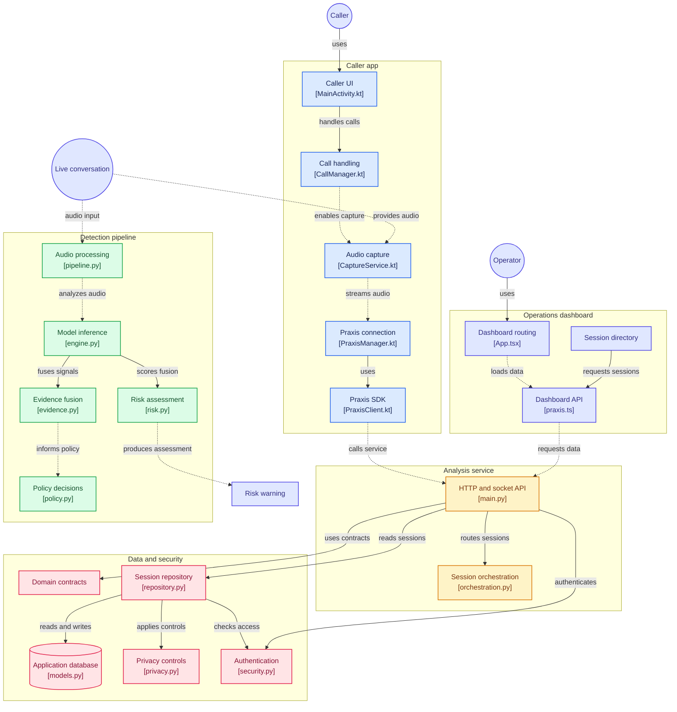

# 🛡️ PRAXIS
### Real-Time AI-Powered Voice Scam Detection & Protection System

<p align="center">

  
  
  
  

</p>

<p align="center">
  <b>PRAXIS detects potential voice scams during live conversations by analysing speech, voice characteristics, conversational context and scam patterns — then converts these signals into an actionable risk assessment.</b>
</p>

---

## 🧠 What is PRAXIS?

**PRAXIS** is an AI-driven voice scam detection and protection platform designed to identify suspicious behaviour during phone conversations.

Traditional fraud detection systems often operate **after** a scam has already occurred.

PRAXIS focuses on the critical moment:

> **While the conversation is happening.**

Instead of depending on a single AI model, PRAXIS combines multiple independent signals:

- 🎙️ Voice characteristics
- 🗣️ Speech content
- 🧠 Conversational context
- 🔊 Audio authenticity / spoof detection
- 🚨 Known scam patterns
- 📊 Behavioural evidence

These signals are passed through an **evidence-fusion and risk-engine layer** to produce a unified risk assessment.

---

# 🚨 The Problem

Voice-based scams are becoming increasingly sophisticated.

Attackers can use:

- Social engineering
- Impersonation
- Urgency and fear
- Fake banking support
- OTP requests
- KYC scams
- Investment scams
- Government impersonation
- AI-generated / synthetic voices
- Manipulated or replayed audio

A simple keyword detector is not enough.

For example:

> "Your bank account has been flagged. Please verify your OTP immediately."

The system needs to understand more than the word `OTP`.

It needs to determine:

**What is being said?**

**Who is speaking?**

**Does the voice appear authentic?**

**Does the conversation resemble a known scam pattern?**

**How dangerous is the overall interaction?**

This is the problem PRAXIS attempts to solve.

---

WATCH ⬇️

https://github.com/user-attachments/assets/f0ce1f3b-13a4-4fc9-9f0a-44b1e86ed6d9

[](https://gitdiagram.com/debopom26/praxis_?utm_source=readme&utm_medium=picture)



# 🎯 Core Objective

PRAXIS aims to provide:

```text
LIVE CONVERSATION
       ↓
AUDIO CAPTURE
       ↓
MULTI-SIGNAL AI ANALYSIS
       ↓
EVIDENCE FUSION
       ↓
RISK ENGINE
       ↓
REAL-TIME WARNING
```

---

# 🚀 How to Try PRAXIS — Complete End-to-End Flow

You do **not** need Azure, Microsoft, Cloudflare, Docker, or any infrastructure credentials to try the hosted Praxis demo.

The normal user flow is:

```text
PRAXIS WEBSITE
      ↓
Click "Try Praxis"
      ↓
CREATE A PRAXIS ACCOUNT / SIGN IN
      ↓
SERVER STARTS AUTOMATICALLY IF NEEDED
      ↓
OPEN THE DASHBOARD
      ↓
DOWNLOAD PRAXIS CALLER FROM GITHUB RELEASES
      ↓
INSTALL + GRANT PERMISSIONS + SET AS DEFAULT PHONE APP
      ↓
SIGN IN TO THE APP WITH THE SAME PRAXIS ACCOUNT
      ↓
PLACE A PRAXIS VoIP CALL TO ANOTHER LOGGED-IN PRAXIS USER
      ↓
LIVE CALL → PRAXIS ANALYSIS → RISK / EVIDENCE
```

## 1️⃣ Open the Praxis Dashboard from the Website

Start from the **Praxis website** and click **Try Praxis**.

That opens the hosted Praxis dashboard:

**https://praxisdashboard.debopomrc2602.workers.dev/**

You should not need to manually start a VM or sign in to any cloud provider.

---

## 2️⃣ Create Your Own Praxis Login

If this is your first time using Praxis, choose the option to **create a new workspace/account** on the dashboard.

Create your own:

- **Organization / Workspace ID**
- **Organization name**
- **Username / Login ID**
- **Password**

Remember these details. You will use the **same Praxis credentials in the Android app** later.

After creating the account, sign in to the dashboard using your Praxis credentials.

### ⚡ The server starts automatically

The hosted Praxis analysis server does not stay online permanently.

If it is currently switched off, simply creating an account or attempting to log in causes Praxis to request the server startup automatically.

You may briefly see:

> **Starting Praxis…**

The client will keep checking while the backend and AI services boot. Once the server is ready, the login continues normally.

**You do not need Azure/Microsoft access and you do not need to manually start anything.**

---

## ⏱️ Important: Hosted Server Daily Limit

> [!IMPORTANT]
> The public hosted demo currently has a **30-minute total server-runtime allowance per day** because of the current cloud/token allocation limits.

This is server runtime, not just call time. The allowance is shared by the hosted Praxis server while it is running.

Please use the demo time intentionally. When the daily allocation has been exhausted, the hosted server will not start again until the daily allowance resets.

If the server is offline but daily runtime is still available, the next Praxis login/start request can bring it online automatically.

---

## 3️⃣ Download the Android App

Go to the repository's **Releases** page:

**https://github.com/Debopom26/Praxis_/releases/latest**

Download the Android APK from the latest release. The current demo release provides:

```text
Praxis-Caller-VoIP.apk
```

Install the APK on your Android phone. Android may ask you to allow installation from the browser/file manager used to open the APK.

> This is a development/demo APK and is not currently distributed through the Play Store.

---

## 4️⃣ Give Praxis Caller the Required Permissions

Open **Praxis Caller** after installing it.

For the full demo experience, grant the permissions requested by the app, including the relevant:

- Phone / call-management access
- Microphone access
- Notification access
- Contacts access
- Call-history / call-log access

Android versions and phone manufacturers may show the permission prompts slightly differently.

### Set Praxis Caller as the default phone app

When prompted, choose **Set as default phone app** and select Praxis Caller.

This allows the application to provide its normal dialer/call-management experience in addition to the Praxis VoIP mode.

---

# 📞 The Android App Has Two Calling Modes

## Mode 1 — Normal Call

The normal calling mode behaves like a regular phone dialer and uses your phone's **SIM/eSIM and cellular calling system**.

Use it for normal phone calls, contacts, recents and standard call controls.

**The current live Praxis analysis demo is not performed over the normal cellular-call mode.** Android/OEM restrictions prevent Praxis from reliably obtaining the remote cellular-call audio required for this demonstration.

## Mode 2 — Praxis VoIP / Internet Call ✅

This is the mode used to demonstrate **Praxis live voice analysis**.

A Praxis VoIP call is an app-to-app Internet call between Praxis users. Because Praxis owns the VoIP audio path, the incoming voice can be sent through the analysis pipeline while the conversation is happening.

---

## 5️⃣ Sign In to the Android App

Open the **VoIP / Internet** section of Praxis Caller and sign in using the **same Praxis account you created on the dashboard**.

Use the same:

- Organization / Workspace ID
- Username / Login ID
- Password

The latest hosted demo build already knows which Praxis backend to use, so users should not need to enter a tunnel URL or manually configure a server address.

For a two-phone demo, use **two different Praxis usernames**. Do not try to run both phones using the same account at the same time.

---

## 6️⃣ Place a Praxis VoIP Call

Both users should:

1. Install the latest Praxis Caller APK.
2. Grant the required permissions.
3. Be signed in to Praxis.
4. Keep Praxis Caller available/open for the demo.
5. Have an active Internet connection.

On the caller's phone:

1. Open **VoIP / Internet Call**.
2. Enter the **Praxis username of another valid Praxis user who is currently logged in**.
3. Start the Internet/VoIP call.

On the receiving phone:

1. The incoming Praxis call appears in the app.
2. Accept the call.
3. Begin speaking normally.

```text
PHONE A                                 PHONE B
Praxis user A                           Praxis user B
     │                                       │
     │────── Praxis VoIP / Internet call ───▶│
     │                                       │
     │◀────────── live conversation ─────────│
     │                                       │
 incoming remote voice                  incoming remote voice
     │                                       │
     ▼                                       ▼
 Praxis analysis                         Praxis analysis
     │                                       │
     ▼                                       ▼
 risk / evidence                         risk / evidence
```

Praxis analyses the **incoming/remote voice** for each side of the call and produces the available evidence and risk information from the live pipeline.

---

## 7️⃣ Watch the Session on the Dashboard

Keep the web dashboard available during the demo.

As Praxis sessions are created and analysed, the dashboard can be used to inspect the session information, evidence, analysis state and resulting risk information available to the signed-in account.

This gives the full end-to-end demonstration:

```text
TWO PRAXIS USERS
      ↓
ANDROID PRAXIS CALLER
      ↓
VoIP / INTERNET CALL
      ↓
LIVE AUDIO STREAM
      ↓
MULTI-SIGNAL AI PIPELINE
      ↓
EVIDENCE FUSION + RISK ENGINE
      ↓
ANDROID RESULT + WEB DASHBOARD
```

---

# ✅ Quick Demo Checklist

- [ ] Open the Praxis website and click **Try Praxis**
- [ ] Create your Praxis workspace/account
- [ ] Wait for the server to start automatically if it is offline
- [ ] Sign in successfully to the dashboard
- [ ] Download **Praxis-Caller-VoIP.apk** from GitHub Releases
- [ ] Install the APK on both Android phones
- [ ] Grant all required permissions
- [ ] Set Praxis Caller as the default phone app
- [ ] Sign in on each phone with a valid Praxis account
- [ ] Use two different Praxis usernames
- [ ] Select **VoIP / Internet Call** for the Praxis-protected call
- [ ] Enter the other logged-in Praxis user's username
- [ ] Accept the call on the second phone
- [ ] Speak and observe the live Praxis analysis
- [ ] Inspect the resulting session/evidence/risk information in the dashboard
- [ ] Remember the hosted server currently has a **30-minute daily runtime allocation**

---

# 🧩 For Developers

The repository also contains the complete backend, dashboard, Android SDK, deployment and verification material. Developers who want to run or integrate the system rather than simply try the hosted demo can start with:

- [`docs/DEPLOYMENT.md`](docs/DEPLOYMENT.md)
- [`android-sdk/README.md`](android-sdk/README.md)
- [`integrations/android/Praxis_Caller/README.md`](integrations/android/Praxis_Caller/README.md)
- [`docs/VOIP_DEMO.md`](docs/VOIP_DEMO.md)

---

<p align="center">
  <b>PRAXIS_ — detect the risk while the conversation is still happening.</b>
</p>
---

## 🚀 Future Scope

PRAXIS aims to evolve into a smarter and more reliable AI-powered voice security platform.

- 🌍 **Multilingual Scam Detection** – Identify potential scams across different languages.
- 🧠 **Adaptive AI Models** – Improve detection capabilities against evolving scam techniques.
- 📱 **Cross-Platform Integration** – Extend protection across mobile and communication platforms.
- 🔔 **Intelligent Alerts** – Provide contextual warnings during suspicious conversations.
- 🔐 **Privacy-First Architecture** – Strengthen secure audio processing and data protection.
- 📊 **Advanced Risk Analytics** – Enhance scam detection through behavioural analysis and evidence-based scoring.

---

### 🛡️ Our Vision

**To make every digital conversation safer through intelligent, real-time AI protection.**
