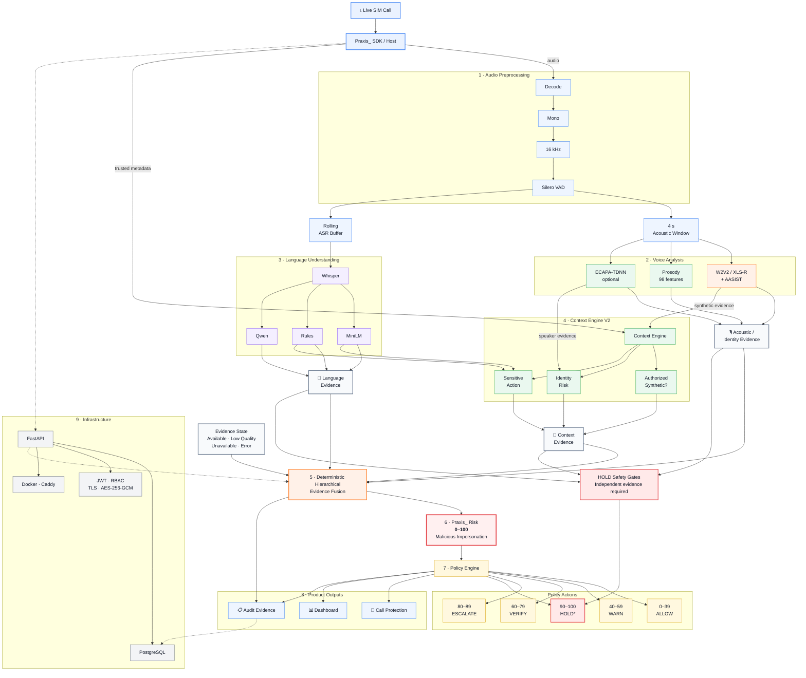

# PRAXIS_ — Real-Time Voice Integrity for Live Calls

Public website for Praxis. Built with TanStack Start, React 19, TypeScript, Vite 7 and Tailwind CSS v4.

## Requirements
- Node.js 20+ (or Bun 1.1+)

## Setup
```sh
npm install        # or: bun install
npm run dev        # open http://localhost:8080
```

## Production build
```sh
npm run build
npm run preview
```

## Project structure
- `src/routes/` — pages (/, /try, /how-it-works, /docs, /validation, /security, /faq, /use-praxis)
- `src/components/praxis/` — site sections (Hero, TryPraxis, AttackLab, ArchitectureCanvas, ...)
- `src/styles.css` — design tokens and utilities

## Editing content
- Validation status: `src/components/praxis/ValidationMatrix.tsx` (COMPONENTS array)
- Team: `src/components/praxis/TeamSection.tsx`
- APK/QR placeholders: `src/components/praxis/FullPraxisCTA.tsx`

## Sharing
- **Live link:** publish from Lovable (Publish button) for a permanent public URL.
- **Temporary preview:** Lovable → Share → Share preview (7 days, no login).
- **Code:** push this folder to GitHub, or share this ZIP.
- **Self-host:** run `npm run build` and deploy to any Node/edge host (default target: Cloudflare Workers).

Demo and scenario simulations on the site are clearly marked and do not represent real model inference.

# Praxis_ System Architecture

> **Praxis_** analyzes live call audio, combines acoustic, linguistic, identity and trusted contextual evidence, and produces an operational malicious-impersonation risk score with policy-driven actions.

---


Praxis_ combines voice authenticity, language, identity and trusted context before deciding whether a call represents malicious impersonation.

© 2026 Praxis_


